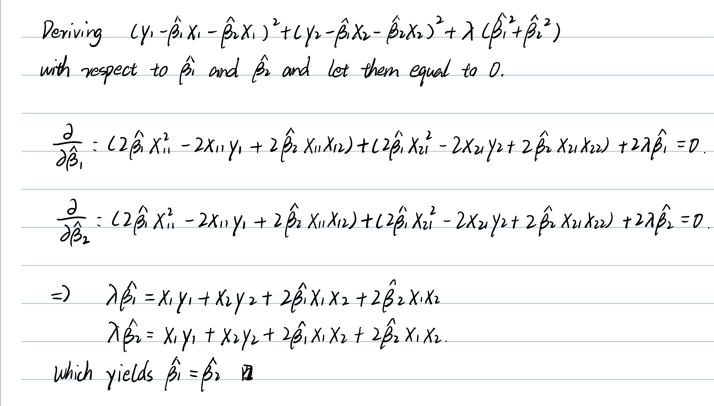
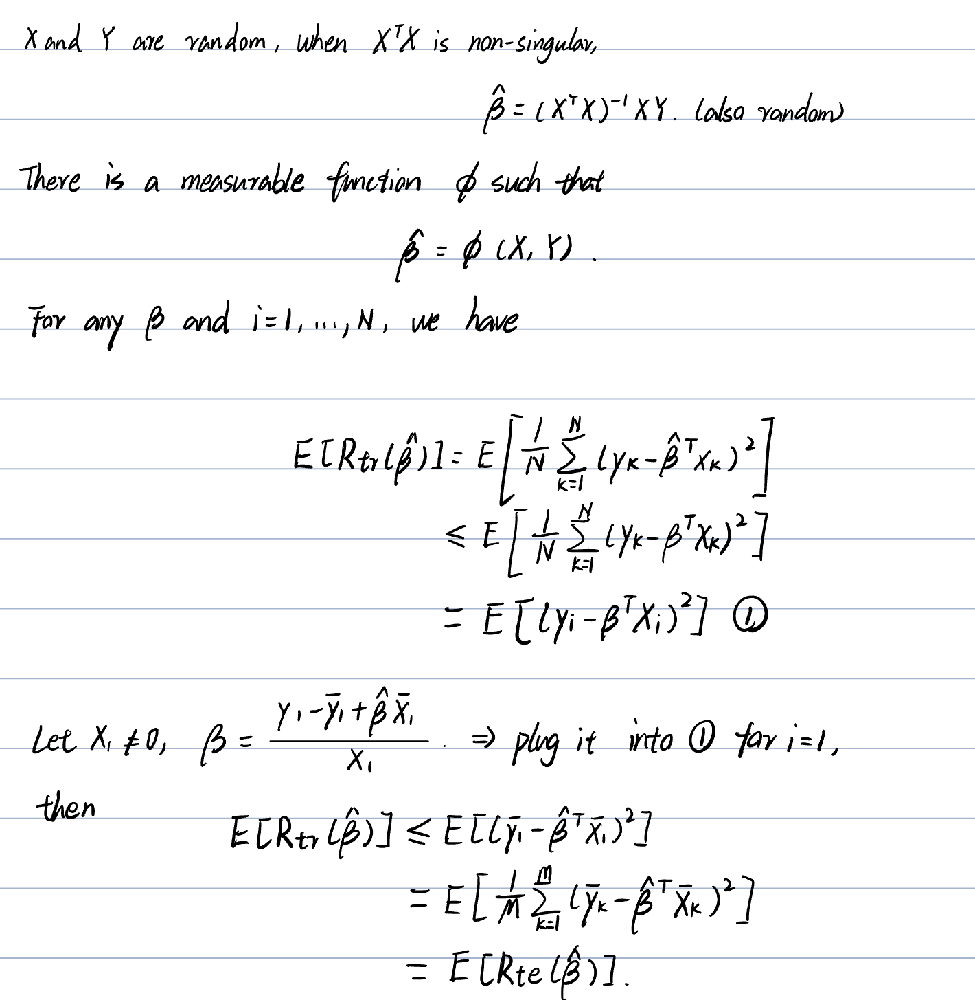

## ISL Exercise 5.4.2 (10pts)
We will now derive the probability that a given observation is part of 
a bootstrap sample. 
Suppose that we obtain a bootstrap sample from a set of n observations.

**(a)**  
$1 - 1/n$  
The probability that the 𝑗th observation is not the first bootstrap 
observation is 1 - 1/n.
Since there are n observations, each has an equal probability of 1/n of being 
chosen first. Therefore, the probability that the jth observation is not 
selected as the first bootstrap observation is 1 − 1/n.

**(b)**  
$1 - 1/n$  
Since each bootstrap observation is independently drawn with replacement, 
every selection follows the same probability distribution.

**(c)**
In bootstrapping, each sample is drawn independently with replacement from the 
original dataset of size n. The probability that the jth observation 
is not chosen in a single draw is 1−1/n. Since we draw n times independently, 
the probability that it never appears in the bootstrap sample is 
$$
(1 - \frac{1}{n}) \cdots (1 - \frac{1}{n}) = (1 - \frac{1}{n})^n
$$

**(d)**  
When n = 5, the probability that the jth observation appears in the bootstrap 
sample is $P(\text{jth obs in bootstrap sample when n=5}) = 1 - (1 - \frac{1}{5})^5 = 0.672.$

**(e)**  
When n = 100, the probability that the jth observation appears in the bootstrap 
sample is $P(\text{jth obs in bootstrap sample when n=100}) = 1 - (1 - 1/100)^{100} = 0.634.$

**(f)**
When n = 1000, the probability that the jth observation appears in the bootstrap 
sample is $P(\text{jth obs in bootstrap sample when n=1000}) = 1 - (1 - \frac{1}{1000})^{1000} = 0.632.$

**(g)**
```{r}
n <- seq(1, 100000, by=10)

prob <- 1 - (1 - 1/n)^n

asymptote <- 1 - 1/exp(1)

asymptote

plot(n, prob, type="l", log="x", 
     xlab="n (log scale)", ylab="Probability of inclusion",
     main="Probability of an Observation in a Bootstrap Sample")

abline(h=1 - 1/exp(1), col="red", lty=2)
```
**(h)**
```{r}
contains_j <- rep(NA, 10000)
for (i in 1:10000) {
    contains_j[i] <- sum(sample(1:100, rep = TRUE) == 4) > 0
}
mean(contains_j)
```
From calculus, we know:

$$
\lim_{n\rightarrow\infty}\left(1 - \frac{1}{n}\right)^n = \frac{1}{e}.
$$

Thus, the probability that a bootstrap sample of size \( n \) contains the \( j \)th observation is:

$$
P(\text{included}) = 1 - \left(1 - \frac{1}{n}\right)^n.
$$

Taking the limit as \( n \to \infty \):

$$
\lim_{n \to \infty} P(\text{included}) = 1 - \frac{1}{e} \approx 0.632.
$$

So for large \( n \), each observation appears in the bootstrap sample about **63.2%** of the time.

## ISL Exercise 5.4.9 (20pts)
```{r}
library(MASS)
library(boot)
attach(Boston)
```

```{r}
mu.hat <- mean(medv)
mu.hat
```
**(b)**
```{r}
se.hat <- sd(medv) / sqrt(dim(Boston)[1])
se.hat
```
**(c)**
```{r}
set.seed(1)
boot.fn <- function(data, index) {
    mu <- mean(data[index])
    return (mu)
}
boot(medv, boot.fn, 1000)
```
**(d)**
```{r}
t.test(medv)
```
**(e)**
```{r}
med.hat <- median(medv)
med.hat
```
**(f)**
```{r}
boot.fn <- function(data, index) {
    mu <- median(data[index])
    return (mu)
}
boot(medv, boot.fn, 1000)
```
We get an estimated median value of 21.2 which is equal to the value got in (e), 
with a standard error of 0.3874 which is relatively small compared to median value.

**(g)**  
```{r}
percent.hat <- quantile(medv, c(0.1))
percent.hat
```
**(h)**
```{r}
boot.fn <- function(data, index) {
    mu <- quantile(data[index], c(0.1))
    return (mu)
}
boot(medv, boot.fn, 1000)
```
We get an estimated tenth percentile value of 12.75 which is again equal to the 
value obtained in (g), with a standard error of 0.5113 which is relatively small 
compared to percentile value.

## Least squares is MLE (10pts)

Show that in the case of linear model with Gaussian errors, maximum likelihood and least squares are the same thing, and $C_p$ and AIC are equivalent.

To show that least squares and maximum likelihood estimation (MLE) are equivalent,
consider the linear model:

$$
Y = X\beta + \varepsilon, \quad \varepsilon \sim \mathcal{N}(0, \sigma^2 I).
$$

The likelihood function for \( Y \) is:

$$
L(\beta, \sigma^2) = \frac{1}{(2\pi\sigma^2)^{n/2}} \exp\left( -\frac{1}{2\sigma^2} \| Y - X\beta \|^2 \right).
$$

Taking the log:

$$
\log L(\beta, \sigma^2) = -\frac{n}{2} \log (2\pi\sigma^2) - \frac{1}{2\sigma^2} \| Y - X\beta \|^2.
$$

Maximizing \( L \) with respect to \( \beta \) is equivalent to minimizing:

$$
\| Y - X\beta \|^2.
$$

which is exactly the least squares objective function. Therefore, 
the OLS estimator is the same as the MLE estimator:

$$
\hat{\beta}_{\text{MLE}} = \hat{\beta}_{\text{OLS}} = (X^T X)^{-1} X^T Y.
$$

Thus, we have shown that least squares and MLE are the same in the Gaussian setting.

---

Mallows' \( C_p \) is defined as:

$$
C_p = \frac{1}{n} (RSS + 2d\hat{\sigma}^2),
$$
- \( RSS \) is the **residual sum of squares**,  
- \( d \) is the **number of parameters**,  
- hat{\sigma}^2 is an estimate of the error variance.

The AIC is:

$$
AIC = -2 \log L + 2d.
$$

Since:

$$
-2 \log L \approx n \log (RSS/n) + \text{constant},
$$

it follows that:

$$
AIC \approx C_p.
$$

Thus, in the Gaussian setting, \( C_p \) and AIC are equivalent in model selection.

## ISL Exercise 6.6.1 (10pts)
**(a)**  
When performing best subset selection, the model with $k$ predictors is chosen 
from all $C_p^k$ possible models with $k$ predictors, selecting the one with the 
**smallest residual sum of squares (RSS)**.

In **forward stepwise selection**, the model with $k$ predictors is selected 
from the $p - k + 1$ models that result from adding one predictor to the best 
$\mathcal{M}_{k - 1}$-predictor model.

In **backward stepwise selection**, the model with $k$ predictors is selected 
from the $k + 1$ models that result from removing one predictor from the best 
$\mathcal{M}_{k + 1}$-predictor model.

Since best subset selection considers all possible models at each step, 
it always finds the model with the **lowest training RSS**, 
making it the most optimal approach in terms of training error.  

**(b)**  
The model selected by best subset selection has the smallest training RSS 
because it evaluates all possible models with k predictors and chooses the one 
with the lowest residual sum of squares (RSS). In contrast, forward stepwise 
selection and backward stepwise selection only explore a subset of possible 
models, meaning they may not always find the model with the lowest RSS. 
However, in some cases, all three methods might end up selecting the same model.  

**(c) True or False:**  
- ***i*** True.  
- ***ii*** True.  
- ***iii*** False.  
- ***iv*** False.  
- ***v*** False.  

## ISL Exercise 6.6.3 (10pts)  
**(a)**  

> **Part iv - The training RSS steadily decreases as \( s \) increases.**  

LASSO regression constrains the sum of absolute values of the coefficients: 
$\sum_{j=1}^{p} |\beta_j| \leq s$ where $s$ controls the degree of regularization.

As $s$ increases, the constraint loosens, allowing the coefficients $\beta_j$ to 
move closer to their least squares estimates. This increases model flexibility 
and leads to a reduction in training RSS.

When $s$ becomes sufficiently large, the constraint no longer affects the 
solution, meaning the estimated coefficients minimize: 
$RSS = \sum_{i=1}^{n} \left( y_i - \beta_0 - \sum_{j=1}^{p} \beta_j x_{ij} \right)^2$ 
and match the ordinary least squares (OLS) estimates. Up to this point, 
the training RSS decreases monotonically as $s$ increases.

**(b)**  

> **Part ii - Decrease initially, then eventually increase in a U shape.**

When $s = 0$, the only $\hat{\beta}$ that satisfies $\sum_{j=1}^{p} |\beta_j| \leq s$ 
is the zero vector, meaning the model simply predicts the mean $\hat{y} = \bar{y}$, leading to a very high test RSS.

As $s$ increases, the restriction loosens, allowing the coefficients $\beta_j$ to take on nonzero values. This increases the model’s flexibility, enabling it to fit the data better and initially decreasing the test RSS.

However, as $s$ continues to increase, the model becomes overly complex, fitting noise in the training data and leading to overfitting. At this stage, test RSS starts rising again, forming a characteristic U-shaped pattern.

**(c)**  

> **Part ii - Steadily increase.**  

As $s$ increases from zero, the constraint region expands, effectively reducing 
$\lambda$ (shrinkage). This increases model flexibility, leading to a steady 
rise in variance. If $s$ becomes large enough that $\hat{\beta}$ falls within 
the unconstrained region, variance stabilizes, as the selected $\hat{\beta}$ 
aligns with the least squares estimate.

**(d)**  

> **Part iv - Steadily Decrease.**  

Similar to part (c), increasing model flexibility reduces bias. As $s$ gets 
larger, constraints loosen, coefficients adjust, and bias is reduced. But as 
soon as the least squares solution lies inside the constraint region, 
bias reduction ceases.  

**(e)**  

> **Part v. - Remain Constant.**  

The irreducible error arises from inherent uncertainty or noise in the system. 
It is invariant to model flexibility since there are some explanatory
variables may be unmeasured or certain variations in $y$ cannot be measured
by $X$. Thus, no matter how well the model is specified, the irreducible error 
is entirely independent of $s$.

$$
\text{Irreducible Error} = \mathbb{E}[(y - f(X))^2]
$$

## ISL Exercise 6.6.4 (10pts)  
**(a)**  

> **Part iii - Steadily Increase.**  

When $\lambda = 0$, ridge regression estimates $\hat{\beta}$ as the least squares solution, since the penalty term is absent. This provides the lowest possible training RSS.
As $\lambda$ increases, the penalty term introduces shrinkage, which decreases the values of $\beta_j$ coefficients. This constraint limits model flexibility, preventing it from fitting the training data as closely. Consequently, the training RSS steadily increases as $\lambda$ grows.

**(b)**

> **Part ii - Decrease initially, then eventually increase in a U shape.**

As $\lambda$ (shrinkage) increases, variance is reduced, which initially outweighs the cost of shrinking $\hat{\beta}$ coefficients towards zero. As a result, the test RSS decreases. 
When $\\\\lambda$ continues to grow, though, over-shrinkage produces underfitting, reducing predictive performance. At this point, the increased bias outweighs the reduced variance, causing test RSS to rise again, forming a characteristic U-shaped pattern.

**(c)**  

> **Part iv - Steadily Decrease.**  

As $\lambda$ increases, model flexibility decreases since the $\beta$ coefficients become smaller in magnitude and shrink toward zero, decreasing variance. This process is repeated as shrinkage intensifies, lowering variance even more.
If $\lambda$ becomes arbitrarily large, $\hat{\beta}$ will be close to zero, bringing variance close to zero, and the model converges to the null model, making all predictions nearly identical.

**(d)**  

> **Part iii - Steadily Increase. Squared bias increases steadily as $\lambda$ gets larger.**  

As $\lambda$ increases, model flexibility decreases, so the $\beta$ coefficients reduce towards zero. This reduction in flexibility increases bias, as the model can no longer capture as much variance in the data. 

**(e)**  

> **Part v - Remain Constant.**  

Irreducible error arises from inherent uncertainty or noise in the system. It is independent of model complexity and remains unchanged regardless of $\lambda$. 
Since this error is fixed by variables outside the model, such as unmeasured variables or random fluctuations in $y$, it is constant.

## ISL Exercise 6.6.5 (10pts)  
**(a)**  
Ridge regression aims to minimize the following objective function:  
$$\sum_{i=1}^{n} \left( y_i - \beta_0 - \sum_{j=1}^{p} \beta_j x_{ij} \right)^2 + \lambda \sum_{j=1}^{p} \beta_j^2
$$

Given that $n = 2$, $p = 2$, and the predictors $x_1$ and $x_2$ are perfectly correlated, the data matrix is:  
$$
X = \begin{bmatrix} x_{11} & x_{12} \\ x_{21} & x_{22} \end{bmatrix}
$$

Since ridge regression estimates coefficients by minimizing the function above, substituting values from this setting gives:  
$$
\sum_{i=1}^{2} \left( y_i - \beta_0 - \beta_1 x_{i1} - \beta_2 x_{i2} \right)^2 + \lambda (\beta_1^2 + \beta_2^2)
$$

Given that $\beta_0 = 0$, the optimization problem simplifies to:  
$$
(y_1 - \beta_1 x_{11} - \beta_2 x_{12})^2 + (y_2 - \beta_1 x_{21} - \beta_2 x_{22})^2 + \lambda (\beta_1^2 + \beta_2^2)
$$
This definition encompasses the trade-off between residual sum of squares minimization and coefficient shrinkage and also adding a penalty on big coefficients, thus being more numerically stable and less affected by multicollinearity. Because ridge regression adds a penalty on $\beta_j^2$, it encourages small and clustered values of the coefficients, particularly when predictors are highly correlated.

**(b)**  
```{r, echo=FALSE, results="asis"}
library(knitr)

```
**(c)**  
The Lasso regression optimization problem is:  
$$
\sum_{i=1}^{n} \left( y_i - \beta_0 - \sum_{j=1}^{p} \beta_j x_{ij} \right)^2 + \lambda \sum_{j=1}^{p} |\beta_j|
$$
Given $n = 2, p = 2$, the predictor matrix is:  
$$
X = \begin{bmatrix} x_{11} & x_{12} \\ x_{21} & x_{22} \end{bmatrix}
$$
Lasso regression estimates coefficients by minimizing:  
$$
\sum_{i=1}^{2} \left( y_i - \beta_0 - \beta_1 x_{i1} - \beta_2 x_{i2} \right)^2 + \lambda (|\beta_1| + |\beta_2|)
$$
With $\beta_0 = 0$, this simplifies to:  
$$
(y_1 - \beta_1 x_{11} - \beta_2 x_{12})^2 + (y_2 - \beta_1 x_{21} - \beta_2 x_{22})^2 + \lambda (|\beta_1| + |\beta_2|)
$$
Since predictors are perfectly correlated:  
$$
2(y_1 - \hat{\beta}_1 x_{11} - \hat{\beta}_2 x_{11})^2 + \lambda (|\beta_1| + |\beta_2|)
$$
**(d)**  
Lasso solutions are not unique because the constraint \( |\hat{\beta}_1| + |\hat{\beta}_2| \leq s \) forms a diamond-shaped region centered at \( (0,0) \). The optimization process seeks to minimize the squared error subject to this constraint.

The objective function:
$$
\sum_{i=1}^{n} \left( y_i - \beta_0 - \sum_{j=1}^{p} \beta_j x_{ij} \right)^2 + \lambda \sum_{j=1}^{p} |\beta_j|
$$

Given the specific setting, the minimization reduces to:
$$
\min \left[ 2(y_1 - (\hat{\beta}_1 + \hat{\beta}_2) x_{11}) \right]
$$
Since the Lasso constraint enforces \( |\hat{\beta}_1| + |\hat{\beta}_2| = s \), this defines a **line segment** on the boundary of the diamond. The final solution is **not unique**, as any point on this edge satisfies the optimization.

We can illustrate this by plotting the feasible region and the solution path.

```{r, echo=FALSE, message=FALSE}

library(ggplot2)

# Define the constraint region
s <- 1
lasso_region <- data.frame(
  x = c(s, 0, -s, 0, s),
  y = c(0, s, 0, -s, 0)
)

# Define possible solutions along one constraint edge
solution_line <- data.frame(
  x = seq(-s, s, length.out = 100),
  y = s - seq(-s, s, length.out = 100)
)

# Plot
ggplot() +
  geom_polygon(data = lasso_region, aes(x, y), fill = "lightblue", alpha = 0.4, color = "blue") +
  geom_line(data = solution_line, aes(x, y), color = "red", linewidth = 1.2) +  # Updated from `size` to `linewidth`
  geom_point(aes(x = 0.5, y = 0.5), color = "black", size = 3) + 
  labs(title = "Lasso Constraint and Non-Unique Solutions",
       x = expression(beta[1]),
       y = expression(beta[2])) +
  theme_minimal()
```

## ISL Exercise 6.6.11 (30pts)

You must follow the [typical machine learning paradigm](https://ucla-biostat-212a.github.io/2024winter/slides/06-modelselection/workflow_lasso.html) to compare _at least_ 3 methods: least squares, lasso, and ridge. Report final results as

| Method | CV RMSE | Test RMSE |
|:------:|:------:|:------:|:------:|
| LS | | | |
| Ridge | | | |
| Lasso | | | |
| ... | | | |

```{r}
library(MASS) 
library(leaps)   
library(glmnet) 
library(pls)    

data(Boston)
set.seed(1)

train_index = sample(1:nrow(Boston), nrow(Boston) * 0.8)
train_data = Boston[train_index, ]
test_data = Boston[-train_index, ]

x_train = model.matrix(crim ~ ., train_data)[, -1]
y_train = train_data$crim

x_test = model.matrix(crim ~ ., test_data)[, -1]
y_test = test_data$crim
```
```{r}
# --------------------------
# Step 1: CV RMSE
# --------------------------
predict.regsubsets = function(object, newdata, id, ...) {
    form = as.formula(object$call[[2]])
    mat = model.matrix(form, newdata)
    coefi = coef(object, id = id)
    xvars = names(coefi)
    mat[, xvars] %*% coefi
}

k = 10
folds = sample(1:k, nrow(Boston), replace = TRUE)
cv.errors = matrix(NA, k, 13, dimnames = list(NULL, paste(1:13)))
for (j in 1:k) {
    best.fit = regsubsets(crim ~ ., data = Boston[folds != j, ], nvmax = 13)
    for (i in 1:13) {
        pred = predict(best.fit, Boston[folds == j, ], id = i)
        cv.errors[j, i] = mean((Boston$crim[folds == j] - pred)^2)
    }
}
mean.cv.errors = apply(cv.errors, 2, mean)
plot(mean.cv.errors, type = "b", xlab = "Number of variables", ylab = "CV error")
```
```{r}
# min CV RMSE
min(mean.cv.errors)
```
```{r}
regfit.best = regsubsets(crim~., data=Boston, nvmax=13)
coef(regfit.best, 12)
```
```{r}
# --------------------------
# Step 2: Lasso
# --------------------------
lasso_model = cv.glmnet(x_train, y_train, alpha = 1, type.measure = "mse")

# CV RMSE
lasso_cv_rmse = sqrt(min(lasso_model$cvm))

# Test RMSE
lasso_pred = predict(lasso_model, s = lasso_model$lambda.min, newx = x_test)
lasso_test_rmse = sqrt(mean((y_test - lasso_pred)^2))

plot(lasso_model)
```
```{r}
# --------------------------
# Step 3: Ridge
# --------------------------
ridge_model = cv.glmnet(x_train, y_train, alpha = 0, type.measure = "mse")

# CV RMSE
ridge_cv_rmse = sqrt(min(ridge_model$cvm))

# Test RMSE
ridge_pred = predict(ridge_model, s = ridge_model$lambda.min, newx = x_test)
ridge_test_rmse = sqrt(mean((y_test - ridge_pred)^2))
```
```{r}
# --------------------------
# Step 4: Least Squares (LS)
# --------------------------
ls_model = lm(crim ~ ., data = train_data)

# CV RMSE
ls_cv_rmse = sqrt(mean(ls_model$residuals^2))

# Test RMSE
ls_pred = predict(ls_model, newdata = test_data)
ls_test_rmse = sqrt(mean((y_test - ls_pred)^2))
```
```{r}
# --------------------------
# Step 5: results
# --------------------------
results <- data.frame(
  Method = c("Least Squares", "Ridge", "Lasso"),
  CV_RMSE = c(ls_cv_rmse, ridge_cv_rmse, lasso_cv_rmse),
  Test_RMSE = c(ls_test_rmse, ridge_test_rmse, lasso_test_rmse)
)

print(results)
```
## Bonus question (20pts)

Consider a linear regression, fit by least squares to a set of training data $(x_1, y_1), \ldots, (x_N,  y_N)$ drawn at random from a population. Let $\hat \beta$ be the least squares estimate. Suppose we have some test data $(\tilde{x}_1, \tilde{y}_1), \ldots, (\tilde{x}_M, \tilde{y}_M)$ drawn at random from the same population as the training data. If $R_{\text{train}}(\beta) = \frac{1}{N} \sum_{i=1}^N (y_i - \beta^T x_i)^2$ and $R_{\text{test}}(\beta) = \frac{1}{M} \sum_{i=1}^M (\tilde{y}_i - \beta^T \tilde{x}_i)^2$. Show that
$$
\operatorname{E}[R_{\text{train}}(\hat{\beta})] < \operatorname{E}[R_{\text{test}}(\hat{\beta})].
$$
```{r, echo=FALSE, results="asis"}
library(knitr)

```