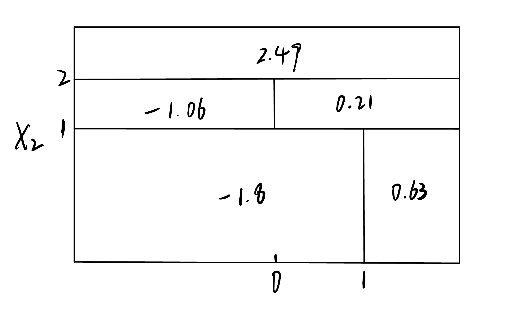

## ISL Exercise 8.4.3 (10pts)
```{r}
p = seq(0, 1, 0.01)
gini = p * (1 - p) * 2
entropy = -(p * log(p) + (1 - p) * log(1 - p))
class.err = 1 - pmax(p, 1 - p)

matplot(p, cbind(gini, entropy, class.err), type = "l", 
        col = c("red", "green", "blue"),
        main = "Comparison of Gini Index, Entropy, and Classification Error")

legend("topright",legend=c("Gini","Entropy", "Class Error"), pch=19, 
       col=c("red", "green", "blue"))
```
## ISL Exercise 8.4.4 (10pts)
(a)
```{r, echo=FALSE, results="asis"}
library(knitr)

```
(b)
```{r, echo=FALSE, results="asis"}
library(knitr)

```
## ISL Exercise 8.4.5 (10pts)

Majority Vote → Red
Averaging Probability → Green
```{r, echo=FALSE, results="asis"}
library(knitr)
include_graphics("isl83.jpeg")
```

## ISL Lab 8.3. `Boston` data set (30pts)

Follow the machine learning workflow to train regression tree, random forest, and boosting methods for predicting `medv`. Evaluate out-of-sample performance on a test set.

```{r}
# Load necessary libraries
library(MASS)         # Boston dataset
library(tree)         # Regression Tree
library(randomForest) # Random Forest
library(gbm)         # Boosting (Gradient Boosting)
# library(ISLR2)
# attach(Carseats)

# Set seed for reproducibility
set.seed(1)

# Split the dataset into training (50%) and testing (50%)
train <- sample(1:nrow(Boston), nrow(Boston) / 2)
Boston.test <- Boston[-train, "medv"]  # Extract true test set values
```

1. Regression tree
```{r}
# Train Regression Tree
tree.Boston <- tree(medv ~ ., Boston, subset = train)
summary(tree.Boston)

# Plot the tree
plot(tree.Boston)
text(tree.Boston)
```
```{r}
# Cross-validation for pruning
cv.Boston <- cv.tree(tree.Boston)
plot(cv.Boston$size, cv.Boston$dev, type = "b")

# Prune the tree with best = 5 (per original code)
prune.Boston <- prune.tree(tree.Boston, best = 5)
plot(prune.Boston)
text(prune.Boston, pretty = 5)
```
```{r}
# Predict on test set and compute MSE
yhat.tree <- predict(tree.Boston, newdata = Boston[-train, ])
Boston.test <- Boston[-train, "medv"]
plot(yhat.tree, Boston.test)
abline(0, 1)

# Compute the test set MSE
tree.mse <- mean((yhat.tree - Boston.test)^2)
tree.mse
```
In other words, the test set MSE associated with the regression tree is 35.29. The square root of the MSE is therefore around 5.941, indicating that this model leads to test predictions that are (on average) within approximately $5,941 of the true median home value for the census tract.

2. RandomForest
```{r}
# Train Bagging model (mtry = 12, per original code)
set.seed(1)
bag.Boston <- randomForest(medv ~ ., data = Boston, 
                           subset = train, mtry = 12, 
                           importance = TRUE)

# Test set prediction & MSE
yhat.bag <- predict(bag.Boston, newdata = Boston[-train, ])
bag.mse <- mean((yhat.bag - Boston.test)^2)
bag.mse

# Train Bagging with ntree = 25 (per original code)
bag.Boston <- randomForest(medv ~ ., data = Boston, 
                           subset = train, mtry = 12, ntree = 25)
yhat.bag <- predict(bag.Boston, newdata = Boston[-train, ])
bag.mse2 <- mean((yhat.bag - Boston.test)^2)
bag.mse2
```
```{r}
# Train Random Forest (mtry = 6, per original code)
set.seed(1)
rf.Boston <- randomForest(medv ~ ., data = Boston,
                          subset = train, mtry = 6, importance = TRUE)

# Test set prediction & MSE
yhat.rf <- predict(rf.Boston, newdata = Boston[-train, ])
rf.mse <- mean((yhat.rf - Boston.test)^2)
rf.mse
```
```{r}
# Feature importance & visualization
importance(rf.Boston)
varImpPlot(rf.Boston)
```

3. Boosting
```{r}
# Train Boosting model (default shrinkage = 0.1)
set.seed(1)
boost.Boston <- gbm(medv ~ ., data = Boston[train, ],
distribution = "gaussian", n.trees = 5000, interaction.depth = 4)

# Visualize variable importance
plot(boost.Boston, i = "rm")
plot(boost.Boston, i = "lstat")

# Test set prediction & MSE
yhat.boost <- predict(boost.Boston, newdata = Boston[-train, ], n.trees = 5000)
boost.mse <- mean((yhat.boost - Boston.test)^2)
boost.mse

# Train Boosting with shrinkage = 0.2 (per original code)
boost.Boston <- gbm(medv ~ ., data = Boston[train, ], 
                    distribution = "gaussian", n.trees = 5000, 
                    interaction.depth = 4, shrinkage = 0.2, verbose = F)

# Test set prediction & MSE
yhat.boost <- predict(boost.Boston, newdata = Boston[-train, ], n.trees = 5000)
boost.mse2 <- mean((yhat.boost - Boston.test)^2)
boost.mse2
```
```{r}
# Compare MSE results
mse_results <- data.frame(
  Model = c("Regression Tree", "Bagging (mtry=12, ntree=500)", 
            "Bagging (mtry=12, ntree=25)", "Random Forest", 
            "Boosting (shrinkage=0.1)", "Boosting (shrinkage=0.2)"),
  MSE = c(tree.mse, bag.mse, bag.mse2, rf.mse, boost.mse, boost.mse2)
)
print(mse_results)

# Plot MSE comparison
barplot(mse_results$MSE, names.arg = mse_results$Model, 
        col = c("red", "blue", "blue", "green", "orange", "orange"), 
        main = "MSE Comparison", ylab = "Mean Squared Error", las = 2, cex.names = 0.8)
```

## ISL Lab 8.3 `Carseats` data set (30pts)

Follow the machine learning workflow to train classification tree, random forest, and boosting methods for classifying `Sales <= 8` versus `Sales > 8`. Evaluate out-of-sample performance on a test set.

```{r}
# Load required libraries
library(tree)          # Classification Tree
library(randomForest)  # Random Forest
library(gbm)           # Gradient Boosting
library(caret)         # Confusion Matrix
library(ISLR2)

# Set seed for reproducibility
set.seed(2)

# Convert Sales into a binary variable
Carseats$High <- factor(ifelse(Carseats$Sales > 8, "Yes", "No"))

# Remove the Sales column
Carseats <- subset(Carseats, select = -Sales)

# Train-test split (50-50)
train <- sample(1:nrow(Carseats), nrow(Carseats) / 2)
Carseats.train <- Carseats[train, ]
Carseats.test <- Carseats[-train, ]
High.test <- Carseats.test$High

# ---- Classification Tree ----
tree.carseats <- tree(High ~ ., data = Carseats.train)
summary(tree.carseats)
plot(tree.carseats)
text(tree.carseats, pretty = 0)

# Test set prediction
tree.pred <- predict(tree.carseats, Carseats.test, type = "class")
confusion_matrix_tree <- table(tree.pred, High.test)
tree_accuracy <- sum(diag(confusion_matrix_tree)) / sum(confusion_matrix_tree)

# ---- Pruning ----
set.seed(7)
cv.carseats <- cv.tree(tree.carseats, FUN = prune.misclass)
prune_size <- cv.carseats$size[which.min(cv.carseats$dev)]  # Select pruning size with minimum error
prune.carseats <- prune.misclass(tree.carseats, best = prune_size)

plot(prune.carseats)
text(prune.carseats, pretty = 0)

# Evaluate pruned tree
tree.pred.pruned <- predict(prune.carseats, Carseats.test, type = "class")
confusion_matrix_pruned <- table(tree.pred.pruned, High.test)
pruned_accuracy <- sum(diag(confusion_matrix_pruned)) / sum(confusion_matrix_pruned)

# ---- Random Forest ----
p <- ncol(Carseats.train) - 1  # Number of features excluding 'High'

# Tune mtry using tuneRF()
set.seed(1)
best_mtry <- tuneRF(Carseats.train[-ncol(Carseats.train)], Carseats.train$High, 
                     stepFactor = 1.5, improve = 0.01, trace = FALSE)
mtry_best <- best_mtry[which.min(best_mtry[,2]), 1]

# Train Random Forest
set.seed(1)
rf.carseats <- randomForest(High ~ ., data = Carseats.train, ntree = 500, mtry = mtry_best, importance = TRUE)

# Test set prediction
rf.pred <- predict(rf.carseats, Carseats.test)
confusion_matrix_rf <- table(rf.pred, High.test)
rf_accuracy <- sum(diag(confusion_matrix_rf)) / sum(confusion_matrix_rf)

# Variable Importance
importance(rf.carseats)
varImpPlot(rf.carseats)

# ---- Boosting ----
boost.train <- Carseats.train
boost.test <- Carseats.test
boost.train$High <- ifelse(boost.train$High == "Yes", 1, 0)  # Convert to 0/1 for Boosting

set.seed(1)
boost.carseats <- gbm(High ~ ., data = boost.train, distribution = "bernoulli",
                      n.trees = 5000, interaction.depth = 4, shrinkage = 0.01, verbose = FALSE)

# Prediction
boost.prob <- predict(boost.carseats, newdata = boost.test, n.trees = 5000, type = "response")
boost.pred <- factor(ifelse(boost.prob > 0.5, "Yes", "No"), levels = levels(High.test))

confusion_matrix_boost <- table(boost.pred, High.test)
boost_accuracy <- sum(diag(confusion_matrix_boost)) / sum(confusion_matrix_boost)

# Variable Importance
summary(boost.carseats)

# Test Boosting with different shrinkage (0.2)
set.seed(1)
boost.carseats2 <- gbm(High ~ ., data = boost.train, distribution = "bernoulli",
                        n.trees = 5000, interaction.depth = 4, shrinkage = 0.2, verbose = FALSE)

boost.prob2 <- predict(boost.carseats2, newdata = boost.test, n.trees = 5000, type = "response")
boost.pred2 <- factor(ifelse(boost.prob2 > 0.5, "Yes", "No"), levels = levels(High.test))

confusion_matrix_boost2 <- table(boost.pred2, High.test)
boost_accuracy2 <- sum(diag(confusion_matrix_boost2)) / sum(confusion_matrix_boost2)

# ---- Confusion Matrix Visualization ----
cat("Classification Tree:\n")
print(confusionMatrix(as.factor(tree.pred), High.test))

cat("\nPruned Tree:\n")
print(confusionMatrix(as.factor(tree.pred.pruned), High.test))

cat("\nRandom Forest:\n")
print(confusionMatrix(as.factor(rf.pred), High.test))

cat("\nBoosting (shrinkage=0.01):\n")
print(confusionMatrix(as.factor(boost.pred), High.test))

cat("\nBoosting (shrinkage=0.2):\n")
print(confusionMatrix(as.factor(boost.pred2), High.test))

# ---- Accuracy Comparison ----
accuracy_results <- data.frame(
  Model = c("Classification Tree", "Pruned Tree", "Random Forest", "Boosting (0.01)", "Boosting (0.2)"),
  Accuracy = c(tree_accuracy, pruned_accuracy, rf_accuracy, boost_accuracy, boost_accuracy2)
)

print(accuracy_results)

barplot(accuracy_results$Accuracy, names.arg = accuracy_results$Model, 
        col = c("red", "blue", "green", "orange", "purple"), 
        main = "Accuracy Comparison", ylab = "Accuracy", las = 2, cex.names = 0.8)
```