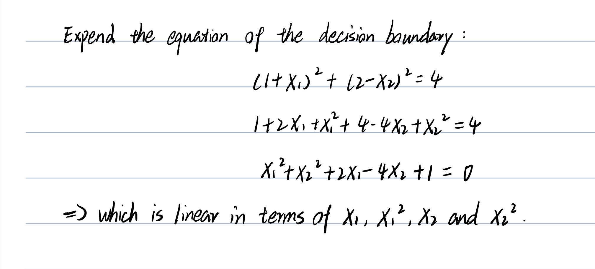

## ISL Exercise 9.7.1 (10pts)
This problem involves hyperplanes in two dimensions.
(a) Sketch the hyperplane 1 + 3X1 − X2 = 0. Indicate the set of points for which 1+3X1 −X2 > 0, as well as the set of points for which 1 + 3X1 − X2 < 0.
(b) On the same plot, sketch the hyperplane −2 + X1 + 2X2 = 0. Indicate the set of points for which −2 + X1 + 2X2 > 0, as well as the set of points for which −2 + X1 + 2X2 < 0.
```{r}
x1 <- -10:10
x2 <- 1 + 3 * x1
plot(x1, x2, type = "l", col = "blue")
text(c(0), c(-20), "Greater than 0", col = "blue")
text(c(0), c(20), "Less than 0", col = "blue")
lines(x1, 1 - x1/2, col = "red")
text(c(0), c(-15), "Less than 0", col = "red")
text(c(0), c(15), "Greater than 0", col = "red")
```

## ISL Exercise 9.7.2 (10pts)
2. We have seen that in p = 2 dimensions, a linear decision boundary takes the form β0 + β1X1 + β2X2 = 0. We now investigate a non-linear decision boundary.
(a) Sketch the curve (1+X1)^2 +(2−X2)^2 =4.
```{r}
plot(NA, NA, type = "n", xlim = c(-4, 2), ylim = c(-1, 5), asp = 1, xlab = "X1", ylab = "X2")
symbols(c(-1), c(2), circles = c(2), add = TRUE, inches = FALSE)
```
(b) On your sketch, indicate the set of points for which (1+X1)^2 +(2−X2)^2 >4, as well as the set of points for which (1+X1)^2 +(2−X2)^2 ≤4.
```{r}
plot(NA, NA, type = "n", xlim = c(-4, 2), ylim = c(-1, 5), asp = 1, xlab = "X1", ylab = "X2")
symbols(c(-1), c(2), circles = c(2), add = TRUE, inches = FALSE)
text(c(-1), c(2), "< 4")
text(c(-4), c(2), "> 4")
```
(c) Suppose that a classifier assigns an observation to the blue class if and to the red class otherwise. To what class is the observation (1+X1)^2 +(2−X2)^2 >4, (0, 0) classified? (−1, 1)? (2, 2)? (3, 8)?
```{r}
plot(c(0, -1, 2, 3), c(0, 1, 2, 8), col = c("blue", "red", "blue", "blue"), 
    type = "p", asp = 1, xlab = "X1", ylab = "X2")
symbols(c(-1), c(2), circles = c(2), add = TRUE, inches = FALSE)
```
(d) Argue that while the decision boundary in (c) is not linear in terms of X1 and X2, it is linear in terms of X1, X12, X2, and X2 .
```{r, echo=FALSE, results="asis"}
library(knitr)

```

## Support vector machines (SVMs) on the `Carseats` data set (30pts)

Follow the machine learning workflow to train support vector classifier (same as SVM with linear kernel), SVM with polynomial kernel (tune the degree and regularization parameter $C$), and SVM with radial kernel (tune the scale parameter $\gamma$ and regularization parameter $C$) for classifying `Sales<=8` versus `Sales>8`. Use the same seed as in your HW4 for the initial test/train split and compare the final test AUC and accuracy to those methods you tried in HW4.

```{r}
# Load necessary libraries
library(e1071)  # For SVM
library(caret)  # For evaluation metrics
library(ISLR2)
library(pROC)
library(ggplot2)
library(lattice)

# Set seed for reproducibility
set.seed(2)

# Convert Sales into binary classification
Carseats$High <- factor(ifelse(Carseats$Sales > 8, "Yes", "No"))

# Remove Sales column
Carseats <- subset(Carseats, select = -Sales)

# Train-test split (50-50)
train_idx <- sample(1:nrow(Carseats), nrow(Carseats) / 2)
Carseats.train <- Carseats[train_idx, ]
Carseats.test <- Carseats[-train_idx, ]
High.test <- Carseats.test$High
```
```{r}
# Train SVC (linear kernel)
svc_model <- svm(High ~ ., data = Carseats.train, kernel = "linear", cost = 1, scale = TRUE)

# Prediction and evaluation
svc_pred <- predict(svc_model, Carseats.test)
confusion_matrix_svc <- confusionMatrix(svc_pred, High.test)

# Display accuracy
print(confusion_matrix_svc$overall["Accuracy"])

# Extract decision values and ensure it's a numeric vector
svc_pred_prob <- attr(predict(svc_model, Carseats.test, decision.values = TRUE), "decision.values")[, 1]

# Compute ROC and AUC
svc_roc <- roc(High.test, svc_pred_prob)
print(svc_roc$auc)
```
```{r}
# Tune hyperparameters for polynomial kernel
set.seed(2)
tune_poly <- tune(svm, High ~ ., data = Carseats.train, kernel = "polynomial",
                  ranges = list(cost = c(0.1, 1, 10), degree = c(2, 3, 4)))

# Best model
best_poly_model <- tune_poly$best.model
poly_pred <- predict(best_poly_model, Carseats.test)
confusion_matrix_poly <- confusionMatrix(poly_pred, High.test)

# Accuracy and AUC
print(confusion_matrix_poly$overall["Accuracy"])
poly_pred_prob <- attr(predict(best_poly_model, Carseats.test, decision.values = TRUE), "decision.values")[, 1]
poly_roc <- roc(High.test, poly_pred_prob)
print(poly_roc$auc)
```
```{r}
# Tune hyperparameters for radial kernel
set.seed(2)
tune_radial <- tune(svm, High ~ ., data = Carseats.train, kernel = "radial",
                    ranges = list(cost = c(0.1, 1, 10), gamma = c(0.01, 0.1, 1)))

# Best model
best_radial_model <- tune_radial$best.model
radial_pred <- predict(best_radial_model, Carseats.test)
confusion_matrix_radial <- confusionMatrix(radial_pred, High.test)

# Accuracy and AUC
print(confusion_matrix_radial$overall["Accuracy"])
radial_pred_prob <- attr(predict(best_radial_model, Carseats.test, decision.values = TRUE), "decision.values")[, 1]
radial_roc <- roc(High.test, radial_pred_prob)
print(radial_roc$auc)
```
```{r}
# Compile accuracy and AUC into a dataframe
results <- data.frame(
  Model = c("SVC (Linear)", "SVM (Polynomial)", "SVM (Radial)"),
  Accuracy = c(confusion_matrix_svc$overall["Accuracy"],
               confusion_matrix_poly$overall["Accuracy"],
               confusion_matrix_radial$overall["Accuracy"]),
  AUC = c(svc_roc$auc, poly_roc$auc, radial_roc$auc)
)

print(results)
```

## Bonus (10pts)

Let
$$
f(X) = \beta_0 + \beta_1 X_1 + \cdots + \beta_p X_p = \beta_0 + \beta^T X. 
$$
Then $f(X)=0$ defines a hyperplane in $\mathbb{R}^p$. Show that $f(x)$ is proportional to the signed distance of a point $x$ to the hyperplane $f(X) = 0$. 
